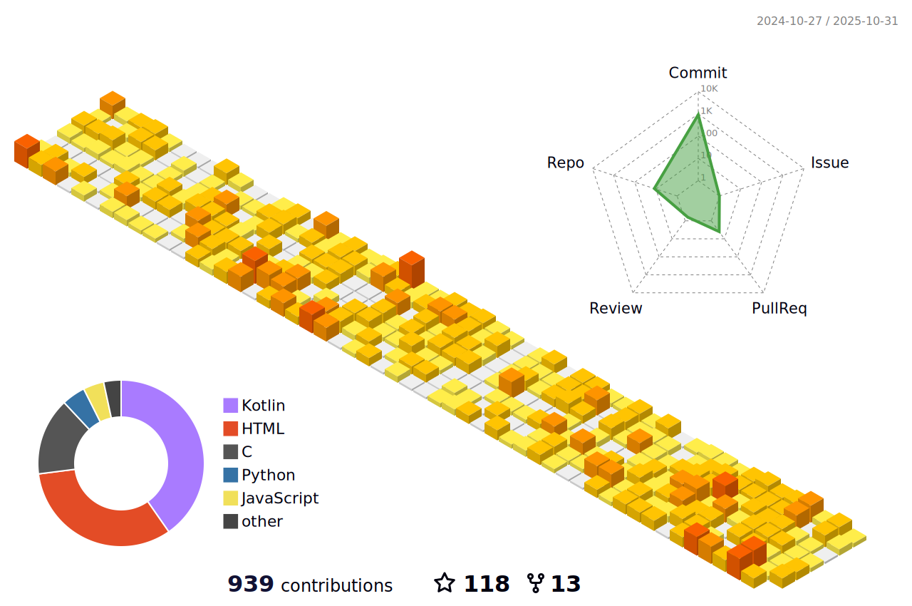

# Hello , Welcome to My Github 😊

Select Language : [简体中文](/README.md) | English

## Profile

I'm an Android developer and I'm passionate about it.

I began to get involved in the world of computers in 2023.

The languages I frequently use are Kotlin,C and Python in sequence.

I currently have an App under maintenance.

I am currently a student at Hefei University of Technology(Xuancheng Campus), majoring in Earth Information Science and Technology in my freshman year. Currently, I am majoring in Computer Science and Technology.

## Contribute

## [Contact zsh0908@outlook.com](zsh0908@outlook.com)
