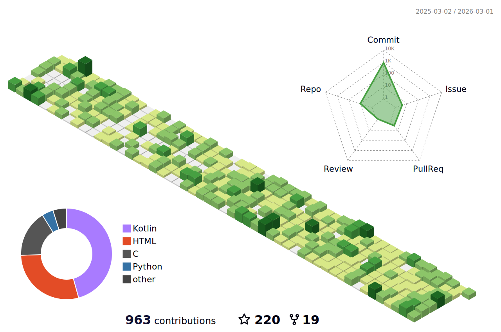

# 嗨 志同道合的你 

## 简介 

我是一名Android开发者，热爱于此，从2023年开始接触计算机的世界;

我经常使用的语言为Kotlin,Java,C,Python，我也探索过其他领域，例如: 后端开发(Spring,Flask,Ktor...)、跨平台开发(Kotlin Multiplatform);

我就读于合肥工业大学(HFUT)宣城校区本科(2023-2027)，大一修地球信息科学与技术专业，目前为计算机科学与技术专业;

我还有很多不足，平时喜欢通过读书、读开源项目、读博客以不断学习。

远期规划由App向Framework层发展，目前在做App层开发，维护[聚在工大](https://github.com/Chiu-xaH/HFUT-Schedule)App以及若干小App及Library;

## 动态

## [联系方式 zsh0908@outlook.com](zsh0908@outlook.com)

