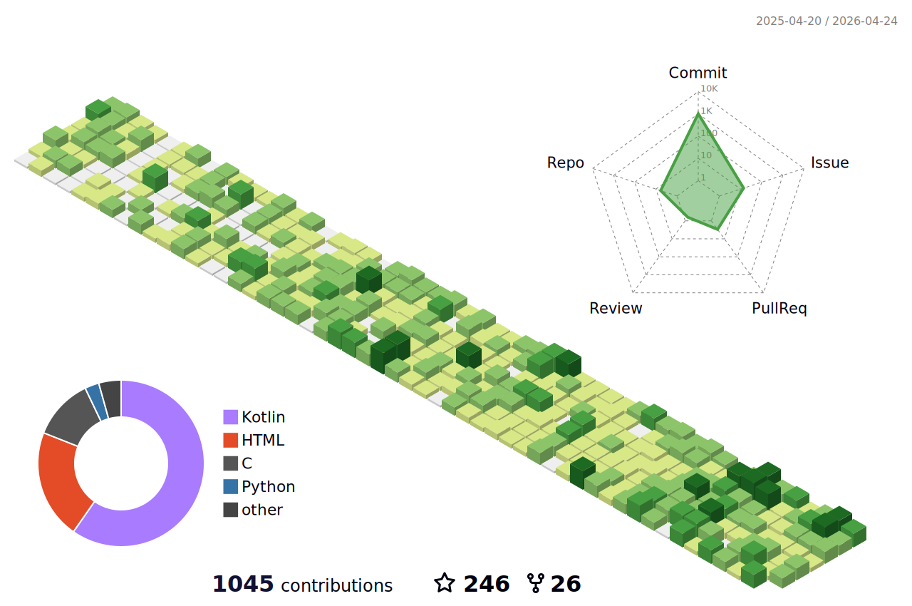

# 嗨 欢迎来相会

## 简介 

我是一名 Android 开发者，我经常使用的语言为 Kotlin，兴趣使然，从 2023 高考之后开始接触编程的世界；

我就读于合肥工业大学(HFUT)宣城校区本科(2023-2027)，大一修地球信息科学与技术专业，目前为计算机科学与技术专业；

我喜欢通过书本、博客、帖子、开源项目及源码来学习相关领域的知识；日常维护 [聚在工大](https://github.com/Chiu-xaH/HFUT-Schedule)、[DiffUpdater](https://github.com/Chiu-xaH/DiffUpdater)、[SharedNav](https://github.com/Chiu-xaH/SharedNav) 等项目，最近在学习 aosp/frameworks/base 中的 Android 系统启动流程；

我的实习经历：2025-12 在蔚来系统应用与框架部从事车机系统 SystemUI 的开发，2026-05 在快手主站技术部从事主站/极速版客户端的开发。

未来规划向 Android Framework 发展，希望能有更多的机会深入研究 View 体系，SystemUI，Launcher，动效等方面。

## 动态

## 联系方式
zsh0908@outlook.com

