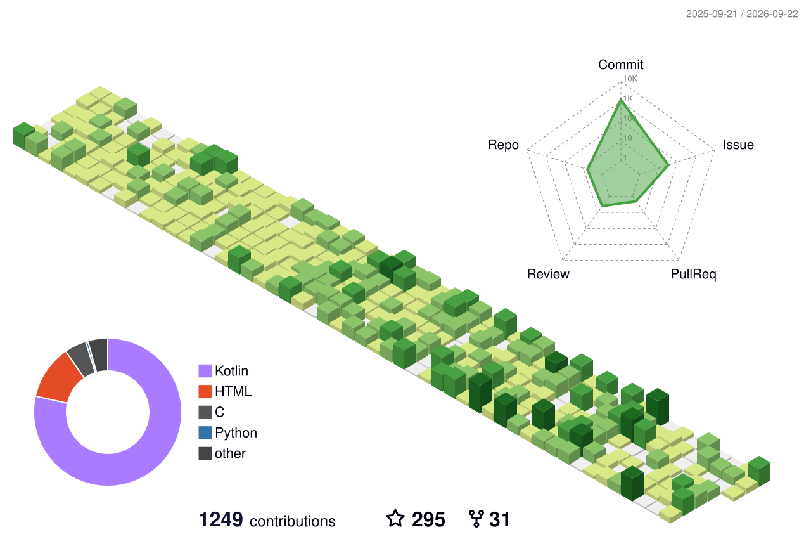

# 嗨 欢迎来相会

## 简介 

我是一名 Android 开发者，兴趣使然，2023 年开始接触并学习；

我就读于合肥工业大学宣城校区本科(2023-2027)，大一修地球信息科学与技术专业，目前为计算机科学与技术专业；

我喜欢通过书本、博客、帖子、开源项目及源码来学习相关知识；日常维护 [聚在工大](https://github.com/Chiu-xaH/HFUT-Schedule)（校园服务 Android 应用）、[DiffUpdater](https://github.com/Chiu-xaH/DiffUpdater)（增量更新 Android 库）、[SharedNav](https://github.com/Chiu-xaH/SharedNav)（容器共享&导航 KMP 库）等项目，累计产出 10w+ 行代码。最近在学习并沉淀 [AOSP 学习系列](https://github.com/Chiu-xaH/My-Aosp-Study)（从 Android 系统启动到启用应用到图形绘制的衔接流程图及流程梳理）；

我的实习经历：2025-12 在蔚来系统应用与框架部从事车机系统 SystemUI 的开发，2026-05 在快手主站技术部从事主站/极速版客户端的开发。很感谢在蔚来帮助我打开对系统层的兴趣，在快手帮助我扩展技术的广度、AI Coding 的能力。

我未来规划向 Android Framework 发展，希望能有更多的机会深入研究 View、图形绘制体系，动效等方面，我给自己的建议是：收敛技术栈的广度，锚定其中一点去深入，了解为什么这么设计，力争成长为本领域资深的工程师。

## 动态

## 联系方式
zsh0908@outlook.com

